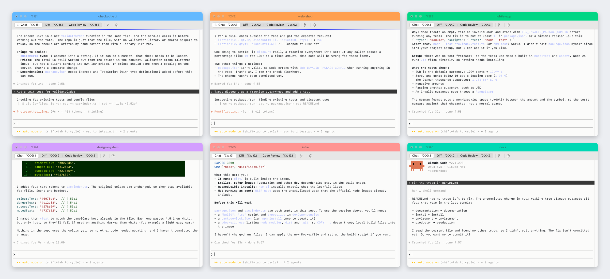

# sessionhue · terminal session colors

Give every terminal session its own color and title, so you can tell 10, 20 or 50 open sessions apart at a glance. Built for people who run many sessions in parallel, for example several Claude Code agents in different repos.



> [!IMPORTANT]
> **The colored title bar needs [iTerm2](https://iterm2.com) (free).** macOS Terminal.app cannot color its title bar or tabs, so there you only get a small colored dot in the tab title. `sessionhue setup` installs and configures iTerm2 for you, and your shell, prompt and plugins stay exactly as they are. [Why?](#which-terminal)

- **Color without touching your output.** The color lives in the tab or title bar, never as a background behind console text.
- **Accessible by default.** Wherever a label sits on the color, sessionhue keeps WCAG AAA contrast (7:1) and adjusts colors that fall short. A built-in checker shows the numbers.
- **Any color, fast.** Pick from a palette in an interactive menu, or use any `#hex`.
- **Presets per repo.** Save a look once, and every new session in that repo gets it automatically.
- **Suggestions from your history.** sessionhue looks at the repos you worked in (including past Claude Code sessions) and proposes a distinct color for each.
- **Scales to 50+ sessions.** After the 12 named colors, new colors are generated to be as different as possible from the ones already in use.

## Install

Pick one. All three end in the same guided setup, where every step is optional.

### One command

Paste this into Terminal:

```sh
/bin/bash -c "$(curl -fsSL https://github.com/getitdone-gmbh/sessionhue/releases/latest/download/install.sh)"
```

### Double-click

1. Download [Install-sessionhue.zip](https://github.com/getitdone-gmbh/sessionhue/releases/latest/download/Install-sessionhue.zip) and double-click it to unzip.
2. Double-click **Install sessionhue.command**.
3. The first time, macOS says it cannot verify the developer, because the installer is not notarized by Apple. Open **System Settings > Privacy & Security**, scroll down and click **Open Anyway** next to "Install sessionhue.command". Or right-click the file and choose **Open**.

### npm

```sh
npm install -g https://github.com/getitdone-gmbh/sessionhue/releases/latest/download/sessionhue.tgz
sessionhue setup
```

The installer needs Node.js 18 or newer. If it is missing and Homebrew is installed, it installs Node.js for you. sessionhue runs on macOS; Linux works for kitty, WezTerm and generic terminals.

### What `sessionhue setup` asks

On macOS:

- Install iTerm2 with Homebrew, if it is missing (needed for the colored title bar, see [Which terminal?](#which-terminal))
- Use the iTerm2 Minimal theme, so the color fills the whole title bar
- Install a readable light iTerm2 profile where all text colors reach AAA (off by default)
- Add a **Terminal iTerm** launcher: keep typing "terminal" in Spotlight, Alfred or Raycast and get iTerm2

Everywhere:

- Color tabs automatically when you `cd` into a repo (one line in `~/.zshrc` or `~/.bashrc`)
- Color Claude Code sessions automatically (off by default)
- Create presets for the repos you worked in

iTerm2 overwrites its settings when it quits, so setup asks to quit iTerm2 before changing them. Run setup from Terminal.app for the smoothest first run. You can run `sessionhue setup` again at any time.

## Quick start

```sh
sessionhue blue api        # color this tab blue, title "api"
sessionhue                 # or pick a color from a menu
sessionhue suggest --save  # presets for the repos you work in
```

## Which terminal?

**The colored title bar needs iTerm2.** macOS Terminal.app cannot color its title bar or tabs, so there sessionhue can only put a colored dot in the tab title (`🔵 api`). That is a hard limit of Terminal.app; sessionhue deliberately does not draw overlays on top of other apps.

| You use | What you get |
| --- | --- |
| iTerm2 (Minimal theme) | The whole title bar in the session color, with the title on it. Readable from across the room. |
| Terminal.app | A colored dot in front of the tab title. |

Switching from Terminal.app to iTerm2 keeps everything you have: the same zsh, prompt theme, plugins, aliases and Claude Code. Only the window around it changes.

`sessionhue setup` does the switch for you: it installs iTerm2, turns on the Minimal theme and adds the **Terminal iTerm** launcher to /Applications, so typing "terminal" in Spotlight, Alfred or Raycast keeps working. Pick "Terminal iTerm" once; after that it stays on top. If it does not show up, the Spotlight index has not caught up yet: wait a moment, or type `reload` in Alfred.

By hand:

1. Install iTerm2 (free): `brew install --cask iterm2` or [iterm2.com](https://iterm2.com)
2. Use the Minimal theme (iTerm2 > Settings > Appearance > Theme > Minimal), so the color fills the whole title bar
3. Optional: `sessionhue launcher` for the "Terminal iTerm" launcher, and **iTerm2 > Make iTerm2 Default Term**
4. Optional: a readable light color profile, see [below](#optional-readable-light-profile-for-iterm2)

sessionhue detects the terminal on its own. You can keep using both side by side: iTerm2 shows the bar, Terminal.app the dot.

### Your shell stays yours

sessionhue only sets the tab color and title. Your shell, prompt theme and plugins (oh-my-zsh, starship, powerlevel10k, ...) and your terminal profile stay exactly as they are.

### Optional: readable light profile for iTerm2

iTerm2's default colors put light cyan and magenta on a white background, which is hard to read. If you want a light profile where every text color reaches AAA contrast (7:1), install the optional extra:

```sh
sessionhue profile iterm            # adds "sessionhue Light AAA" to iTerm2 profiles
sessionhue profile iterm --default  # and makes it the default (run with iTerm2 closed)
```

iTerm2 overwrites its settings when it quits, so `--default` only works while iTerm2 is closed: run it from Terminal.app, or let `sessionhue setup` quit iTerm2 for you. Windows that are already open keep their old profile; open a new one with **Profiles > sessionhue Light AAA**. You can also set it by hand in **iTerm2 > Settings > Profiles > sessionhue Light AAA > Other Actions > Set as Default**.

It only changes colors, font (SF Mono 13) and margins. Nothing in your shell setup.

## Usage

```sh
sessionhue                    # interactive picker with suggestions and presets
sessionhue set blue api       # color this tab blue, title "api"
sessionhue blue api           # same, shorter
sessionhue set "#ff8800"      # any hex color (lifted to AAA if needed)
sessionhue set green --save   # and remember it for this repo
sessionhue reset              # back to the default look
```

### Presets and suggestions

```sh
sessionhue suggest            # repos you worked in, each with a proposed color
sessionhue suggest --save     # choose which ones become presets
sessionhue preset list
sessionhue preset add api --color teal --title "API" --match ~/code/api
sessionhue preset rm api
sessionhue apply              # apply the preset for the current folder
```

A preset matches a folder and everything inside it. The most specific match wins.

### Automatic coloring

The shell hook applies the matching preset when you `cd` into a repo. It also keeps your title in place when the shell or a prompt framework (oh-my-zsh, starship, ...) resets it on every prompt.

```sh
# ~/.zshrc
eval "$(sessionhue init zsh)"

# ~/.bashrc
eval "$(sessionhue init bash)"
```

The Claude Code hook colors the tab when a session starts and re-applies it after Claude Code renames the tab for a new topic:

```sh
sessionhue claude          # print the hook config
sessionhue claude --write  # add it to ~/.claude/settings.json
```

If you prefer your own titles over Claude Code's automatic ones, set `CLAUDE_CODE_DISABLE_TERMINAL_TITLE=1`.

## Colors

```sh
sessionhue colors
```

`red`, `orange`, `amber`, `green`, `teal`, `cyan`, `blue`, `indigo`, `purple`, `pink`, `brown`, `gray`, or any `#hex`. German names work too (`rot`, `blau`, `gruen`, ...).

## Accessibility

Color is never the only signal: every session also has a text title.

When a label is drawn on top of the color (iTerm2 title bar, kitty and WezTerm tabs), the color must reach the configured contrast against black or white text. In kitty and WezTerm sessionhue also sets that text color. iTerm2 picks the title color itself and dims the title of inactive windows, so there the active window gets the full contrast. The default is **AAA (7:1)**. Every palette color passes. Custom colors that don't are shifted to the closest passing shade, and sessionhue tells you about it.

```sh
sessionhue check "#0090ff"
#  #0090ff with #000000 text: 6.43:1
#    AA  (4.5:1) pass
#    AAA (7:1)   fail
#    closest AAA shade: #1499ff (7.03:1)

sessionhue check "#e5484d" --text "#ffffff"   # check a specific text color
```

`check` exits with code 1 when the color fails the configured level, so you can use it in scripts.

## Terminal support

| Terminal | Indicator | Status |
| --- | --- | --- |
| iTerm2 | Colored tab and title bar (Minimal theme: whole title bar) + title | tested |
| Terminal.app | Colored dot in the tab title, e.g. `🔵 api` | tested |
| kitty | Colored tab with black/white label + title (needs `allow_remote_control yes`) | untested |
| WezTerm | Colored tab via user vars + title (snippet below) | untested |
| Ghostty, others | Colored dot in the tab title | untested |

Terminal.app and Ghostty cannot color tabs, so the closest of nine colored dots is used there. Reports and fixes for the untested terminals are very welcome.

### WezTerm snippet

```lua
wezterm.on("format-tab-title", function(tab)
  local vars = tab.active_pane.user_vars
  local title = tab.active_pane.title
  if vars.sessionhue_bg and vars.sessionhue_bg ~= "" then
    return {
      { Background = { Color = vars.sessionhue_bg } },
      { Foreground = { Color = vars.sessionhue_fg } },
      { Text = " " .. title .. " " },
    }
  end
  return title
end)
```

## Configuration

`~/.config/sessionhue/config.json` (change the folder with `SESSIONHUE_HOME`):

```json
{
  "contrast": "AAA",
  "autoColorUnknownRepos": false,
  "autoColorSessions": true,
  "presets": [
    { "name": "api", "color": "#0bd8b6", "title": "API", "match": ["/Users/me/code/api"] }
  ]
}
```

- `contrast`: `"AAA"` (7:1), `"AA"` (4.5:1) or `"off"`.
- `autoColorUnknownRepos`: on `apply`, give repos without a preset their suggested color.
- `autoColorSessions`: on `apply`, give every session without a preset a color of its own that no other open session uses, e.g. when you always start in your home folder. The tab keeps its title, and the session keeps its color until it is closed.

## Uninstall

```sh
sessionhue launcher remove
rm -f ~/Library/Application\ Support/iTerm2/DynamicProfiles/sessionhue-light-aaa.json
npm uninstall -g sessionhue
rm -rf ~/.config/sessionhue
```

Then remove the `eval "$(sessionhue init zsh)"` line from your shell config and the `sessionhue apply` hooks from `~/.claude/settings.json`, if you added them. iTerm2 itself stays installed.

## Development

```sh
git clone https://github.com/getitdone-gmbh/sessionhue.git
cd sessionhue
npm install
npm run build
npm test
npm link        # use your local build as the global `sessionhue`
./scripts/build-release.sh   # release assets into ./release
```

## License

[0BSD](LICENSE): do whatever you want with it. No conditions, no attribution required.
